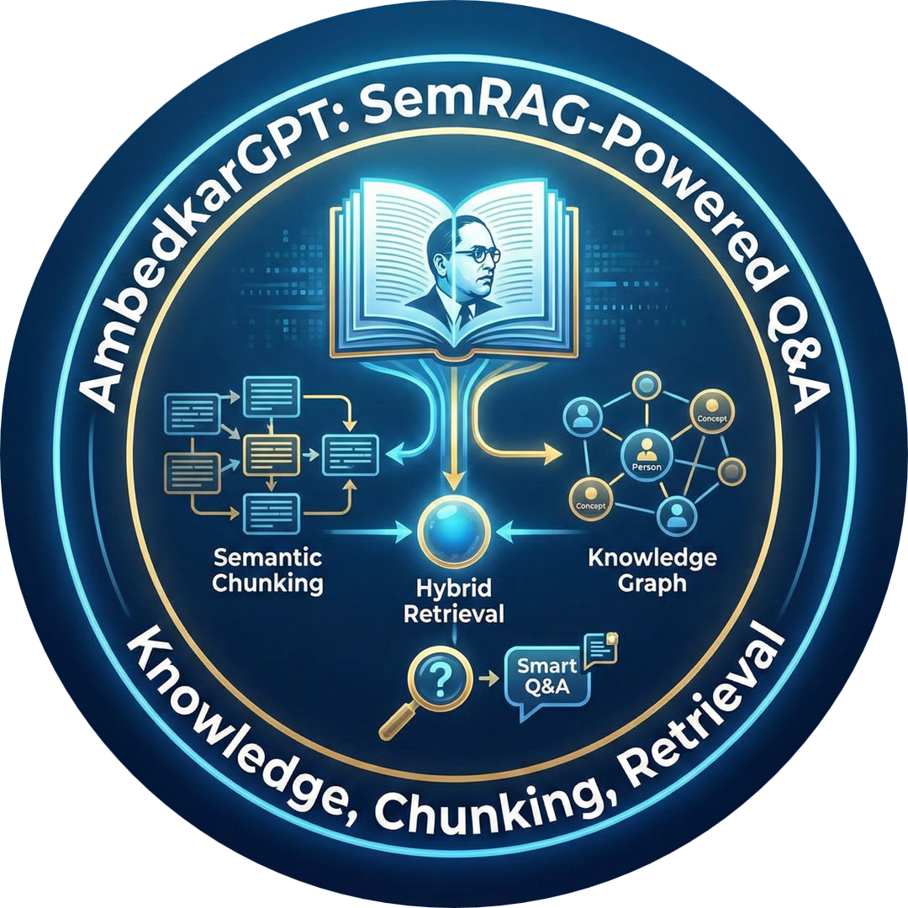
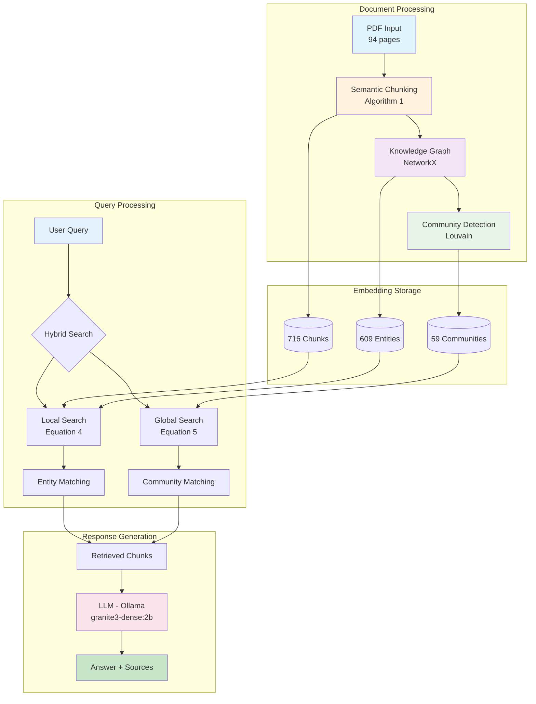

# AmbedkarGPT

<div align="center">
  
</div>

### SemRAG-Powered Q&A System on Dr. B.R. Ambedkar's Works

[](https://python.org)
[](https://streamlit.io)
[](https://ollama.ai)
[](LICENSE)

*A fully functional RAG system implementing the **SemRAG research paper** methodology to intelligently answer questions about Dr. B.R. Ambedkar's works using semantic chunking and knowledge graphs.*

[Features](#features) • [Architecture](#architecture) • [Installation](#installation) • [Usage](#usage) • [Demo](#demo) • [Documentation](#documentation)

---

## Overview

**AmbedkarGPT** is an advanced Retrieval Augmented Generation (RAG) system built following the [SemRAG research paper](https://arxiv.org/abs/2507.21110) approach. It processes a 94-page PDF of Dr. B.R. Ambedkar's book, creates semantic chunks, builds a knowledge graph with community detection, and uses both local and global search strategies to provide accurate, context-aware answers.

### Key Highlights

- **100% Local Execution** - Runs entirely on your machine using Ollama
- **Semantic Chunking** - Algorithm 1 from SemRAG for intelligent text segmentation
- **Knowledge Graph** - 609 entities, 6,228 relationships, 59 communities
- **Dual Search** - Local (Equation 4) and Global (Equation 5) RAG strategies
- **Interactive UI** - Beautiful Streamlit interface with graph visualization

---

## Features

<table>
<tr>
<td width="50%">

### Semantic Chunking
- Cosine similarity-based sentence grouping
- Buffer merging for context preservation
- Token limit enforcement (max 1024)
- Sentence embeddings via all-MiniLM-L6-v2

</td>
<td width="50%">

### Knowledge Graph
- spaCy NER for entity extraction
- Dependency parsing for relationships
- Louvain community detection
- LLM-generated community summaries

</td>
</tr>
<tr>
<td width="50%">

### Hybrid Retrieval
- Local search: Entity to Chunk mapping
- Global search: Community to Theme mapping
- Configurable thresholds (tau_e, tau_d)
- Weighted score combination

</td>
<td width="50%">

### Smart Q&A
- Context-aware answers with citations
- Multi-turn conversation memory
- Source highlighting with relevance scores
- Streaming response support

</td>
</tr>
</table>

---

## Architecture



---

## Project Structure

```
ambedkargpt/
|-- data/
|   |-- Ambedkar_book.pdf              # Input document (94 pages)
|   +-- processed/                     # Generated indices
|       |-- chunks.json                # 716 semantic chunks
|       |-- entities.json              # 609 extracted entities
|       |-- knowledge_graph.pkl        # NetworkX graph
|       |-- communities.json           # 59 detected communities
|       |-- community_summaries.json   # LLM-generated summaries
|       +-- embeddings.npz             # Vector embeddings
|
|-- src/
|   |-- chunking/                      # Semantic Chunking (Algorithm 1)
|   |   |-- semantic_chunker.py        # Main chunking algorithm
|   |   +-- pdf_loader.py              # PDF text extraction
|   |
|   |-- graph/                         # Knowledge Graph Construction
|   |   |-- entity_extractor.py        # spaCy NER
|   |   |-- relationship_extractor.py  # Dependency parsing
|   |   |-- graph_builder.py           # NetworkX graph
|   |   |-- community_detector.py      # Louvain algorithm
|   |   +-- summarizer.py              # LLM summaries
|   |
|   |-- retrieval/                     # Search Algorithms
|   |   |-- local_search.py            # Equation 4 implementation
|   |   |-- global_search.py           # Equation 5 implementation
|   |   +-- hybrid_search.py           # Combined search
|   |
|   |-- llm/                           # LLM Integration
|   |   |-- llm_client.py              # Ollama wrapper
|   |   |-- prompt_templates.py        # Prompt engineering
|   |   +-- answer_generator.py        # Response generation
|   |
|   +-- pipeline/                      # Main Pipelines
|       |-- indexer.py                 # Document processing
|       +-- query_engine.py            # Query interface
|
|-- ui/
|   +-- app.py                         # Streamlit application
|
|-- demo/
|   +-- demo_questions.py              # Demo script
|
|-- tests/                             # Unit tests
|-- config.yaml                        # Configuration
|-- requirements.txt                   # Dependencies
+-- README.md                          # This file
```

---

## Installation

### Prerequisites

- Python 3.9+
- [Ollama](https://ollama.ai) installed and running
- 8GB+ RAM recommended

### Step 1: Clone the Repository

```bash
git clone https://github.com/pranav271103/SemRAG_Ambedkar_QnA.git
cd SemRAG_Ambedkar_QnA/ambedkargpt
```

### Step 2: Create Virtual Environment

```bash
python -m venv venv

# Windows
.\venv\Scripts\activate

# Linux/Mac
source venv/bin/activate
```

### Step 3: Install Dependencies

```bash
pip install -r requirements.txt
```

### Step 4: Download NLP Models

```bash
# spaCy model
python -m spacy download en_core_web_sm

# NLTK data
python -c "import nltk; nltk.download('punkt'); nltk.download('punkt_tab')"
```

### Step 5: Setup Ollama

```bash
# Pull the LLM model
ollama pull granite3-dense:2b

# Verify Ollama is running
ollama list
```

---

## Usage

### 1. Index the Document

First, process the PDF and build all indices:

```bash
python -m src.pipeline.indexer
```

This takes ~20-30 minutes and creates:
- Semantic chunks from the PDF
- Knowledge graph with entities and relationships
- Community detection and summaries
- Vector embeddings for search

### 2. Launch the Web UI

```bash
streamlit run ui/app.py
```

Open http://localhost:8501 in your browser.

### 3. Or Run Demo Script

```bash
python demo/demo_questions.py
```

---

## Demo

### Sample Questions

Try these questions to explore the system:

| # | Question |
|---|----------|
| 1 | What were Dr. Ambedkar's views on the caste system? |
| 2 | How did Ambedkar contribute to drafting the Indian Constitution? |
| 3 | Explain Ambedkar's thoughts on education and social reform. |
| 4 | What was the Poona Pact and its significance? |
| 5 | Describe Ambedkar's conversion to Buddhism. |

### UI Features

- **Chat Tab**: Conversational Q&A with source citations
- **Knowledge Graph Tab**: Interactive graph visualization
  - Filter by entity type (PERSON, ORG, GPE, etc.)
  - Search for specific entities
  - Zoom, pan, and drag nodes
  - View connection statistics

---

## Configuration

Edit `config.yaml` to customize:

```yaml
# Embedding Model
embedding:
  model_name: "sentence-transformers/all-MiniLM-L6-v2"

# LLM Configuration
llm:
  model_name: "granite3-dense:2b"  # Or llama3:8b, mistral:7b

# Semantic Chunking
chunking:
  similarity_threshold: 0.5
  max_tokens: 1024

# Retrieval Thresholds
retrieval:
  local:
    entity_threshold: 0.6    # tau_e
    document_threshold: 0.4  # tau_d
  hybrid:
    local_weight: 0.6
    global_weight: 0.4
```

---

## Documentation

### SemRAG Algorithms

#### Algorithm 1: Semantic Chunking

```python
def semantic_chunk(text):
    sentences = split_into_sentences(text)
    embeddings = encode(sentences)  # all-MiniLM-L6-v2
    
    chunks = []
    current = [sentences[0]]
    
    for i in range(1, len(sentences)):
        similarity = cosine_sim(embeddings[i], embeddings[i-1])
        if similarity >= threshold:
            current.append(sentences[i])
        else:
            chunks.append(current)
            current = [sentences[i]]
    
    return merge_small_chunks(chunks)
```

#### Equation 4: Local Search

```
D_retrieved = Top_k({v in V, g in G | sim(v, Q+H) > tau_e and sim(g, v) > tau_d})
```

- `V`: Entity set with embeddings
- `G`: Chunk set
- `tau_e`: Entity similarity threshold
- `tau_d`: Document similarity threshold

#### Equation 5: Global Search

```
D_retrieved = Top_k(Union_{r in R_Top-K(Q)} Union_{c_i in C_r} (Union_{p_j in c_i} (p_j, score)))
```

- `R`: Community reports/summaries
- `C_r`: Chunks in community r
- Aggregates chunks from top-K communities

---

## System Statistics

After indexing the 94-page Ambedkar book:

| Metric | Value |
|--------|-------|
| Text Extracted | 262,892 characters |
| Semantic Chunks | 716 |
| Entities Extracted | 609 |
| Relationships Found | 7,477 |
| Graph Edges | 6,228 |
| Communities Detected | 59 |

---

## Testing

Run unit tests:

```bash
pytest tests/ -v
```

---

## Tech Stack

| Category | Technology |
|----------|------------|
| Language | Python 3.9+ |
| Embeddings | sentence-transformers (all-MiniLM-L6-v2) |
| NER | spaCy (en_core_web_sm) |
| Graph | NetworkX |
| Communities | python-louvain |
| LLM | Ollama (granite3-dense:2b) |
| UI | Streamlit |
| Visualization | PyVis |

---

## License

This project is licensed under the MIT License - see the [LICENSE](LICENSE) file for details.

---

## Acknowledgments

- [SemRAG Research Paper](https://arxiv.org/abs/2507.21110) for the methodology
- Dr. B.R. Ambedkar for his invaluable contributions to social justice
- Ollama team for local LLM inference
- Streamlit for the amazing UI framework

---

## Author

**Pranav**

- GitHub: [@pranav271103](https://github.com/pranav271103)

---

### Star this repo if you find it helpful!
